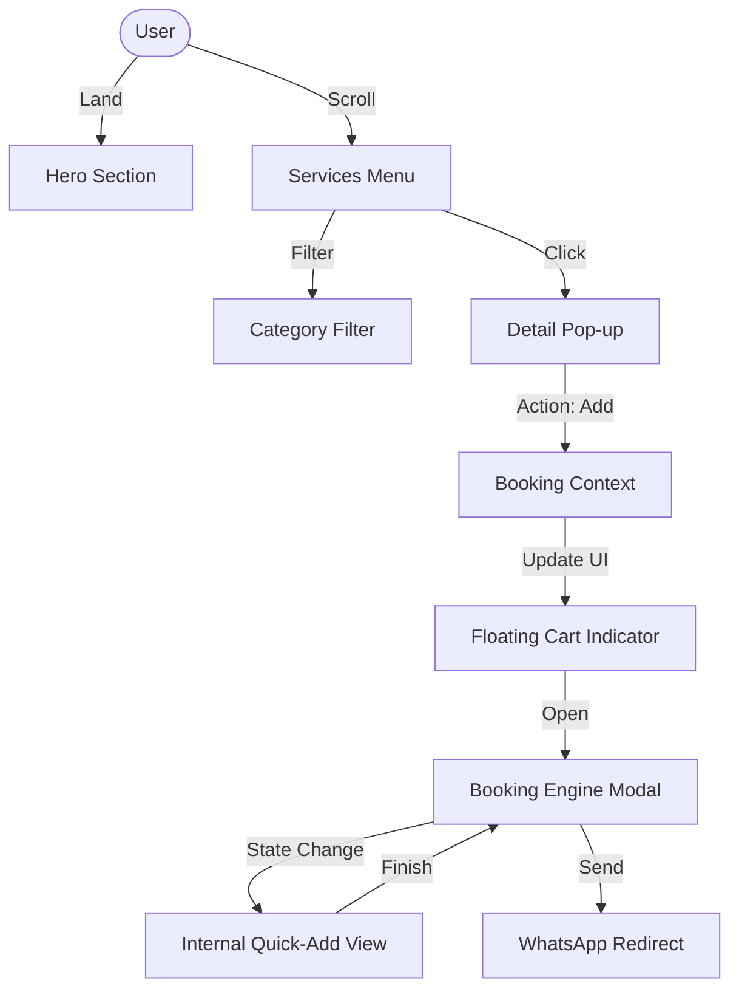

# 🌿 Mnaranai Cinnamon: Master Documentation & Architecture Blueprint

This is the comprehensive guide to the Mnaranai Cinnamon project, covering everything from design philosophy and technical architecture to the granular UX flow of the booking system.

---

## 🎨 1. Design Philosophy & Brand Identity

The application follows a **"Premium Organic"** aesthetic, specifically tailored for luxury service-based businesses.

- **Visual Language**: 
  - **Typography**: `Playfair Display` (Headings) for elegance; `Poppins` (Body) for modern readability.
  - **Color Palette**: `brand-dark` (Graphite), `brand-accent` (Cinnamon/Terracotta), `brand-cream` (Natural Off-white).
  - **Styling**: Soft rounded corners (`rounded-3xl`), glassmorphism effects (`backdrop-blur`), and high-quality imagery.
- **Goal**: Create a high-trust environment that converts visitors into leads via a seamless, mobile-first experience.

---

## 🏗️ 2. Core Technical Architecture

The system is built on **Next.js 14** using the **App Router** and **Centralized State Pattern**.

### State Management (`BookingContext.tsx`)
A global React Context handles the core business logic:
- `selectedServices[]`: A reactive array of chosen treatments.
- `bookingDetails`: An object tracking user inputs (Name, Date, Guests, etc.).
- `isBookingOpen`: A global toggle for the main conversion interface.

### The Component Ecosystem
- **`BookingProvider`**: Wraps the root layout to ensure state persistence across pages.
- **`BookingModal`**: The heavy-lifter component handling lead capture and treatment management.
- **`BookingCartIndicator`**: A sticky floating UI that provides instant feedback on "cart" status.
- **`FloatingBookButton`**: A strategic Call-to-Action (CTA) for quick accessibility.

---

## 🌀 3. The End-to-End User Journey

### Phase 1: Discovery (The Landing Page)
1. **Hero Section**: Hooks the user with a strong value prop and an "Explore Services" CTA.
2. **Social Proof**: Real-time Google Reviews (fetched via **Server Actions** in `reviews.ts`) build immediate credibility.
3. **About/Why Us**: Contextualizes the brand and establishes trust.

### Phase 2: Selection (The Interactive Menu)
1. **Filterable Menu**: Users browse treatments by category (Massage, Beauty, Scrub, etc.).
2. **Detail Modal**: Clicking a service opens a visual-heavy pop-up with a full description and "Add to Booking" CTA.
3. **State Sync**: Clicking "Add" closes the detail view and updates the global counter.

### Phase 3: Conversion (The Lead Generation)
1. **Review & Form**: The user opens the main `BookingModal` to see their selections and fill out their details.
2. **The "Add More" Flow**: Users can jump from the form into a "Quick Add" grid inside the same modal to stack more services.
3. **Execution**: The system compiles a formatted markdown message and triggers a direct WhatsApp redirect.

---

## 🖼️ 4. The Modal & Pop-up Lifecycle (Deep Dive)

The system uses a **Recursive Interaction Pattern** to keep users focused within the conversion funnel.

### Pop-up Sequence:
1. **Detail Pop-up**:
   - `Trigger`: Service Card Click.
   - `Purpose`: Information & Hook.
2. **Booking Engine Modal**:
   - `Trigger`: "Add to Booking" or "Cart Indicator" click.
   - `State A (Summary & Form)`: Displays selected items and collects appointment details.
   - `State B (Quick-Add Grid)`: An internal transition (via `isAddingMore` state) that shows a dense 2-column grid of all services for one-click adding.
3. **WhatsApp Redirection**:
   - `Trigger`: Final CTA.
   - `Logic`: Encodes a formatted message: `Details` + `Service List` + `Approx. Total`.



---

## 🚀 5. Implementation & Setup Guide

To port this entire system to another project, copy the following core components:

### Files to Copy:
1. `src/context/BookingContext.tsx` (Logic)
2. `src/components/ui/BookingModal.tsx` (Conversion UI)
3. `src/components/ui/Modal.tsx` (Base Component)
4. `src/components/layout/BookingCartIndicator.tsx` (Persistence UI)
5. `src/types/index.ts` (Data Structures)

### Configuration Template:
Update these constants in `BookingModal.tsx`:
```typescript
const phone = "XXXXXXXXXX"; // WhatsApp number (Country code first)
const treatments = [ ... ];  // Your array of service objects
```

### Integration:
```tsx
// src/app/layout.tsx
import { BookingProvider } from "@/context/BookingContext";

export default function RootLayout({ children }) {
  return (
    <BookingProvider>
      {children}
      <BookingModal />
      <BookingCartIndicator />
    </BookingProvider>
  );
}
```

---

## 📝 6. WhatsApp Message Output Format

When the user submits, the business receives a message like this:

> *NEW BOOKING REQUEST* 🌿
> 
> *Details:*
> Name: John Smith
> Date: 2024-07-20
> Time: 10:30 AM
> Guests: 2
> 
> *Services Requested:*
> - Cinnamon Relax ($30)
> - African Facial ($30)
> 
> *Approx. Total:* $60
> 
> *Notes:* It's my partner's birthday!
> 
> Please confirm availability!

---

*This blueprint ensures a standardized, high-performance booking experience across any service-based landing page.*
