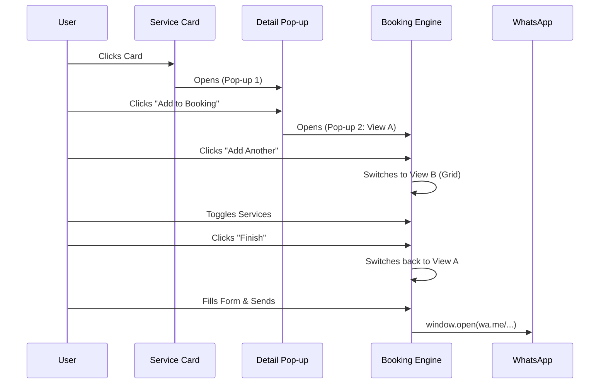

# 🌀 The Booking Lifecycle: Pop-up & Interaction Flow

This guide details the multi-layered modal system and state transitions used in the Booking Engine. Use this to replicate the exact "feel" and flow in other projects.

---

## 🖼️ 1. Visual Flow Overview

The system uses a **Recursive Modal Pattern** where the user can manage their entire booking without ever leaving the current page view or losing their scroll position.

### Step-by-Step UX Path:

1.  **Selection (The Entry Point)**
    - User explores the **Services Section**.
    - User clicks a service card.
    - **Trigger**: `setSelectedItem(item)` in `Services.tsx`.

2.  **Pop-up #1: Service Details (The Hook)**
    - Displays high-res image, full description, and price.
    - **Actions**:
        - `Close`: Returns to menu.
        - `Add to Booking`: 
            - Calls `openBooking(selectedItem)`.
            - Closes Detail Modal.
            - Updates Global `BookingContext`.

3.  **Pop-up #2: The Booking Engine (The Conversion)**
    - This is a dynamic modal with two internal states managed by `isAddingMore`.
    
    **View A: Summary & Form (Default)**
    - **Treatment List**: Scrollable list of everything currently in the "cart".
    - **Form**: Name, Date, Time, Guests, and Notes fields.
    - **CTA 1**: "Add Another Service" → Switches to View B.
    - **CTA 2**: "Send to WhatsApp" → Formats and Redirects.

    **View B: Quick-Add Grid (The Upsell)**
    - Triggered within the modal to keep the user focused.
    - Shows a dense 2-column grid of all available treatments.
    - Users can toggle services on/off instantly.
    - **Action**: "Finish Selection" → Returns to View A.

4.  **The Persistent Anchor: Floating Cart Indicator**
    - If the user closes the modal to keep browsing, a floating bubble stays visible.
    - Displays the `selectedServices.length`.
    - **Action**: Re-opens the Booking Engine Modal precisely where the user left off.

---

## ⚙️ 2. State Logic & Transitions

### Context-Level State (`BookingContext.tsx`)
```typescript
{
  selectedServices: Treatment[], // Persistent cart
  isBookingOpen: boolean,        // Main modal toggle
  bookingDetails: object         // Form data
}
```

### Component-Level State (`BookingModal.tsx`)
```typescript
const [isAddingMore, setIsAddingMore] = useState(false);
```
- **Why?** Handling the "Add More" view at the component level prevents unnecessary global re-renders and keeps the logic "local" to the UI transition.

---

## 🎨 3. Animation & Timing

To achieve the "Premium" feel, the following animations are applied using `Framer Motion` and `Tailwind`:

- **Overlay**: `bg-brand-dark/80` with a `backdrop-blur-sm`.
- **Content Entry**: `scale-90 → scale-100` with `opacity-0 → opacity-1`.
- **Internal Transitions**: When switching between "Review" and "Add More", a horizontal slide animation (`slide-in-from-right` / `slide-in-from-left`) is used to denote "moving deeper" or "going back".

---

## 📲 4. The Final Execution (WhatsApp Logic)

The final "Pop-up" is actually the user's browser opening the WhatsApp application. The system handles the URI encoding to ensure line breaks (`\n`) and bold text (`*text*`) are preserved.



---

*This flow ensures that the path from "Interest" (seeing a service) to "Action" (booking) has zero friction and keeps the user within a controlled environment.*
