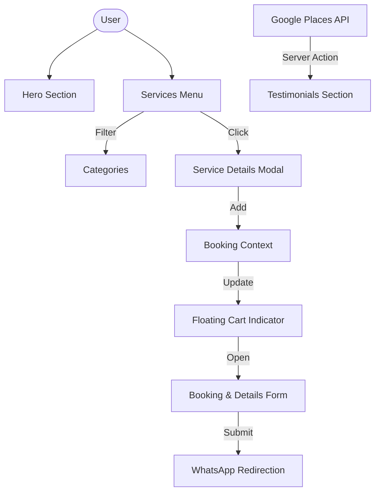

# 🌿 Mnaranai Cinnamon: System Flow & Design Architecture

This document outlines the end-to-end architecture, user experience flow, and technical design of the Mnaranai Cinnamon web application.

---

## 🎨 1. Design Philosophy

The application follows a **"Premium Organic"** aesthetic.
- **Typography**: Playfair Display (Serif) for headings to convey elegance; Poppins (Sans-serif) for body text for readability.
- **Color Palette**:
    - `brand-dark`: Deep graphite for luxury and contrast.
    - `brand-accent`: Terracotta/Cinnamon tones for warmth.
    - `brand-cream`: Soft off-white for a natural, clean background.
- **Visuals**: High-quality imagery with soft rounded corners (`rounded-3xl` or `rounded-[2.5rem]`) and glassmorphism effects (`backdrop-blur`).

---

## 🛠️ 2. Technical Stack

- **Frontend**: Next.js 14 (App Router)
- **Styling**: Tailwind CSS for utility-first design.
- **State Management**: React Context API for the global booking state.
- **Animations**: Framer Motion for smooth transitions and scroll-reveal effects.
- **Icons**: Lucide React.
- **Backend/APIs**: 
    - **Server Actions**: Used for fetching Google Reviews.
    - **Google Places API**: Real-time social proof.
    - **WhatsApp API**: Direct-to-business communication channel.

---

## 🌀 3. The Core User Flow

### Phase 1: Discovery (Landing Page)
1. **Hero Section**: Users are greeted with the brand's core value proposition and a CTA to "Explore Services".
2. **About/Why Us**: Establishes trust and brand story.
3. **Social Proof**: Integrated Google Reviews (automatically fetched via Server Actions) build immediate credibility.

### Phase 2: Selection (Service Menu)
1. **Filtering**: Users can filter treatments by category (Massage, Beauty, Facial, etc.).
2. **Details**: Clicking a service opens a detailed view with pricing and full description.
3. **Selection**: "Add to Booking" interacts with the `BookingContext`, updating the global cart and showing the `BookingCartIndicator`.

### Phase 3: Booking (Conversion)
1. **Cart Review**: Users can see how many treatments they've selected via the floating indicator.
2. **Final Form**: The `BookingModal` collects user details (Name, Date, Time, etc.).
3. **Execution**: The system formats the data and redirects the user to WhatsApp with a pre-filled, professional request.

---

## 🗄️ 4. Data Architecture

### A. Static Data
- Treatment lists and pricing are stored locally in `src/components/sections/Services.tsx` for instant loading and SEO.

### B. Live Data (Reviews)
- Managed via `getCachedGoogleReviews` in `src/app/actions/reviews.ts`.
- **Flow**: Server Action → Google Places V1 API → Normalization → UI.
- **Caching**: 24-hour revalidation to optimize API quotas.

### C. Client State (Booking)
- **Context API (`BookingContext.tsx`)**
    - `selectedServices[]`: Tracks active selections.
    - `bookingDetails`: Tracks name, date, etc.
    - `isBookingOpen`: UI toggle for the modal.

---

## 📂 5. File Structure Overview

```text
src/
├── app/
│   ├── layout.tsx        # Root layout, Providers (BookingProvider)
│   ├── page.tsx          # Main assembly of sections
│   └── actions/          # Server-side logic (Reviews API)
├── components/
│   ├── layout/           # Sticky Navbar, Footer, CartIndicator
│   ├── sections/         # Visual sections (Hero, Services, Contact)
│   └── ui/               # Reusable primitives (Modal, Buttons)
├── context/
│   └── BookingContext.tsx # Central nervous system for booking
└── types/
    └── index.ts          # Unified TS Interfaces
```

---

## 🔀 6. Interaction Diagram



---

*This architecture is designed for speed, SEO, and high conversion, prioritizing the mobile user experience for on-the-go travelers.*
